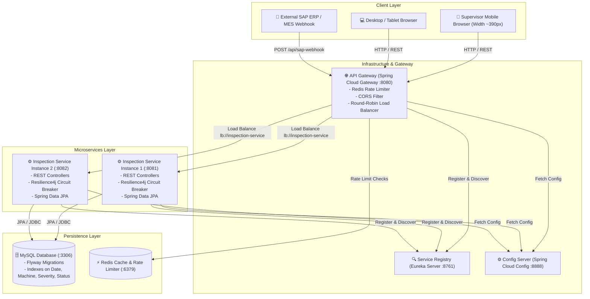

# 🏭 Quality Inspection Tracker

> **A Mobile-First Digital Quality Inspection Application for Textile Manufacturing Plants across Gujarat & Maharashtra.**

---

## 📋 Table of Contents
1. [Project Overview](#-project-overview)
2. [Problem Statement](#-problem-statement)
3. [Architecture Diagram](#-architecture-diagram)
4. [Technology Stack](#-technology-stack)
5. [Default User Credentials & Roles](#-default-user-credentials--roles)
6. [Service URLs & Endpoints Summary](#-service-urls--endpoints-summary)
7. [Setup Instructions](#-setup-instructions)
8. [How to Run the Application](#-how-to-run-the-application)
9. [API Documentation & Swagger](#-api-documentation)
10. [Sample API Requests & Responses](#-sample-api-requests--responses)
11. [Database Schema & Migrations](#-database-schema--migrations)
12. [Testing Instructions](#-testing-instructions)
13. [Architecture Decisions & Trade-offs](#-architecture-decisions--trade-offs)
14. [Assumptions](#-assumptions)
15. [Future Improvements](#-future-improvements)

---

## 🌟 Project Overview

The **Quality Inspection Tracker** is an enterprise-grade full-stack digital solution engineered to replace paper registers and spreadsheet-based tracking in fabric manufacturing plants. Designed with a **mobile-first UX**, it empowers shop-floor supervisors to instantly log defects, filter historical records on demand, resolve open issues with mandatory corrective notes, and view real-time quality summaries grouped by severity and status.

---

## 🚨 Problem Statement

Fabric manufacturing plants in industrial hubs across Gujarat and Maharashtra currently record quality defects manually on physical paper registers. These paper records are later re-entered into spreadsheets.

This manual workflow causes critical operational bottlenecks:
* **No Real-Time Visibility:** Quality defects are delayed in reporting, preventing immediate shop-floor intervention.
* **Data Entry Errors:** Double entry (paper → spreadsheet) introduces frequent clerical mistakes.
* **Search & Analysis Barriers:** Historical paper registers cannot be efficiently searched or analyzed.
* **Untracked Open Defects:** Supervisors struggle to track unresolved quality defects across machines and shifts.
* **Lack of Multi-Dimensional Filtering:** Filtering by severity level, machine/line ID, date range, or resolution status is cumbersome and slow.
* **Management Blind Spots:** Plant managers lack immediate visual summaries of critical and major quality incidents.

---

## 🏗️ Architecture Diagram

The system employs a clean, practical microservices architecture utilizing Spring Cloud, Netflix Eureka, Spring Cloud Gateway, Resilience4j, and a mobile-first Angular frontend.



---

## 🛠️ Technology Stack

| Layer | Technology |
| :--- | :--- |
| **Backend Framework** | Java 17, Spring Boot 3.2.5, Spring Cloud 2023.0.1 |
| **Service Discovery & Config** | Netflix Eureka Server, Spring Cloud Config Server |
| **API Gateway** | Spring Cloud Gateway, Reactive Redis Rate Limiting |
| **Resilience & Circuit Breaker** | Resilience4j, OpenFeign |
| **Database & Migrations** | MySQL 8.0, Flyway Database Migration, Spring Data JPA |
| **Frontend Framework** | Angular 22, TypeScript, RxJS, Reactive Forms, Router |
| **Styling & Responsive Design**| Mobile-First CSS3, Touch-optimized UI (min 44px targets), Responsive Cards/Tables |
| **Testing** | JUnit 5, Mockito, Vitest |
| **Containerization** | Docker, Docker Compose, Nginx |
| **API Documentation** | OpenAPI 3.0, SpringDoc Swagger UI |

---

## 🔐 Default User Credentials & Roles

The system is pre-configured with Role-Based Access Control (RBAC). Use the credentials below to log in:

| Username | Password | Role | Permissions & Capabilities |
| :--- | :--- | :--- | :--- |
| **`admin`** | `admin` | **`ADMIN`** | **Full System Access**: View Dashboard, View Inspections, Create Inspections, Edit Inspections, Resolve Inspections, Delete Inspections, SAP Webhook, **User Management (`/users`) & User Creation/Deletion**. |
| **`supervisor`** | `supervisor` | **`SUPERVISOR`** | **Plant Operations**: View Dashboard, View Inspections, Create Inspections, Edit Inspections, Resolve Open Defects, Trigger SAP Webhook Simulator. |
| **`inspector`** | `inspector` | **`INSPECTOR`** | **Read-Only / Viewer**: View Dashboard & View Inspections only (cannot create, edit, resolve, or delete). |

> 💡 **Note**: All users can click on their profile in the top-right header to update their full name or change their password.

---

## 🌐 Service URLs & Endpoints Summary

All default hosts and ports when running via Docker or locally:

| Service / Tool | Host & Port | URL / Endpoint | Purpose |
| :--- | :--- | :--- | :--- |
| **Angular Frontend** | `localhost:80` | [http://localhost](http://localhost) | Main Web Application UI (Mobile-First) |
| **API Gateway** | `localhost:8080` | [http://localhost:8080](http://localhost:8080) | Edge Gateway, Routing, Redis Rate Limiting |
| **Swagger UI (OpenAPI)** | `localhost:8081` | [http://localhost:8081/swagger-ui.html](http://localhost:8081/swagger-ui.html) | Interactive API Documentation & Testing |
| **OpenAPI Spec (JSON)** | `localhost:8081` | [http://localhost:8081/v3/api-docs](http://localhost:8081/v3/api-docs) | Raw OpenAPI v3 JSON Specification |
| **Eureka Service Registry** | `localhost:8761` | [http://localhost:8761](http://localhost:8761) | Eureka Server Dashboard & Active Instances |
| **Config Server** | `localhost:8888` | [http://localhost:8888](http://localhost:8888) | Spring Cloud Config Native Configuration Server |
| **Inspection Service (Inst 1)** | `localhost:8081` | [http://localhost:8081](http://localhost:8081) | Primary Inspection Service Instance |
| **Inspection Service (Inst 2)** | `localhost:8082` | [http://localhost:8082](http://localhost:8082) | Secondary Instance (Docker Load Balancing) |
| **Actuator Health (Inspection)** | `localhost:8081` | [http://localhost:8081/actuator/health](http://localhost:8081/actuator/health) | Service Health Check & Readiness |
| **Actuator Health (Gateway)** | `localhost:8080` | [http://localhost:8080/actuator/health](http://localhost:8080/actuator/health) | API Gateway Health Check |
| **Actuator Health (Config)** | `localhost:8888` | [http://localhost:8888/actuator/health](http://localhost:8888/actuator/health) | Config Server Health Check |
| **MySQL Database** | `localhost:3306` | `jdbc:mysql://localhost:3306/qc_inspection_db` | Relational Storage (User: `qcuser`, Pass: `qcpassword`) |
| **Redis Cache / Rate Limit** | `localhost:6379` | `redis://localhost:6379` | Gateway Redis Token Bucket Rate Limiter |

---

## ⚙️ Setup Instructions

### Prerequisites
* **Java:** OpenJDK / JDK 17+
* **Maven:** Apache Maven 3.8+
* **Node.js:** v18+ or v22+
* **Docker & Docker Compose:** Installed and running

---

## 🚀 How to Run the Application

### ⚡ One-Shot Command (Build & Run Everything)

Run this single command from the project root:

```bash
mvn clean package -DskipTests && docker compose up -d --build
```

To stop everything:
```bash
docker compose down
```

---

### Option A: Using Docker Compose (Step-by-Step)

1. **Build backend JARs:**
   ```bash
   mvn clean package -DskipTests
   ```

2. **Start all services with Docker Compose:**
   ```bash
   docker compose up --build
   ```

3. **Access the application:**
   * **Frontend Web App:** `http://localhost`
   * **API Gateway:** `http://localhost:8080`
   * **Eureka Service Registry Dashboard:** `http://localhost:8761`
   * **Config Server:** `http://localhost:8888`
   * **Inspection Service Instance 1:** `http://localhost:8081`
   * **Swagger UI:** `http://localhost:8081/swagger-ui.html`

---

### Option B: Running Locally (Manual / Development Mode)

1. **Start MySQL & Redis:**
   ```bash
   docker run -d --name qc-mysql -p 3306:3306 -e MYSQL_ROOT_PASSWORD=rootpassword -e MYSQL_DATABASE=qc_inspection_db -e MYSQL_USER=qcuser -e MYSQL_PASSWORD=qcpassword mysql:8.0
   docker run -d --name qc-redis -p 6379:6379 redis:7-alpine
   ```

2. **Start Microservices in sequence:**
   ```bash
   # Terminal 1: Config Server
   cd config-server && mvn spring-boot:run

   # Terminal 2: Eureka Server
   cd eureka-server && mvn spring-boot:run

   # Terminal 3: API Gateway
   cd api-gateway && mvn spring-boot:run

   # Terminal 4: Inspection Service
   cd inspection-service && mvn spring-boot:run
   ```

3. **Start Angular Frontend:**
   ```bash
   cd frontend
   npm install --legacy-peer-deps
   npm start
   ```
   Access frontend locally at `http://localhost:4200`.

---

## 📚 API Documentation

| HTTP Method | Endpoint | Description |
| :--- | :--- | :--- |
| `POST` | `/api/inspections` | Create a new quality inspection (Status auto-assigned to `Open`). |
| `GET` | `/api/inspections` | Retrieve paginated, sorted, and database-filtered quality inspections. |
| `GET` | `/api/inspections/{id}` | Get inspection details by ID. |
| `PATCH` | `/api/inspections/{id}/resolve` | Resolve an open inspection (requires mandatory `resolutionNote`). |
| `GET` | `/api/summary` | Get dashboard aggregated totals grouped by Status and Severity. |
| `POST` | `/api/sap-webhook` | Mock SAP Webhook endpoint to create digital inspections from SAP ERP. |

---

## 📩 Sample API Requests & Responses

### 1. Create Inspection
* **`POST /api/inspections`**

```json
{
  "inspectionDate": "2026-08-12",
  "machineLineId": "LINE-01",
  "defectType": "Weave Defect",
  "severity": "Critical",
  "remarks": "Irregular tension on warp beam causing fabric tear."
}
```

* **Response (`201 Created`):**
```json
{
  "id": 1,
  "inspectionDate": "2026-08-12",
  "machineLineId": "LINE-01",
  "defectType": "Weave Defect",
  "severity": "Critical",
  "remarks": "Irregular tension on warp beam causing fabric tear.",
  "status": "Open",
  "resolutionNote": null,
  "resolvedAt": null,
  "source": "MANUAL",
  "createdAt": "2026-08-12T11:30:00",
  "updatedAt": "2026-08-12T11:30:00"
}
```

---

### 2. View Inspections with Filtering & Pagination
* **`GET /api/inspections?severity=CRITICAL&status=OPEN&page=0&size=10&sortBy=createdAt&sortDir=desc`**

* **Response (`200 OK`):**
```json
{
  "content": [
    {
      "id": 1,
      "inspectionDate": "2026-08-12",
      "machineLineId": "LINE-01",
      "defectType": "Weave Defect",
      "severity": "Critical",
      "remarks": "Irregular tension on warp beam causing fabric tear.",
      "status": "Open",
      "resolutionNote": null,
      "resolvedAt": null,
      "source": "MANUAL",
      "createdAt": "2026-08-12T11:30:00",
      "updatedAt": "2026-08-12T11:30:00"
    }
  ],
  "pageNumber": 0,
  "pageSize": 10,
  "totalElements": 1,
  "totalPages": 1,
  "last": true
}
```

---

### 3. Resolve Inspection
* **`PATCH /api/inspections/1/resolve`**

```json
{
  "resolutionNote": "Machine calibration completed and defective roll isolated."
}
```

* **Response (`200 OK`):**
```json
{
  "id": 1,
  "inspectionDate": "2026-08-12",
  "machineLineId": "LINE-01",
  "defectType": "Weave Defect",
  "severity": "Critical",
  "remarks": "Irregular tension on warp beam causing fabric tear.",
  "status": "Resolved",
  "resolutionNote": "Machine calibration completed and defective roll isolated.",
  "resolvedAt": "2026-08-12T11:45:12",
  "source": "MANUAL",
  "createdAt": "2026-08-12T11:30:00",
  "updatedAt": "2026-08-12T11:45:12"
}
```

---

### 4. Inspection Summary Dashboard
* **`GET /api/summary`**

* **Response (`200 OK`):**
```json
{
  "open": {
    "critical": 3,
    "major": 8,
    "minor": 12,
    "total": 23
  },
  "resolved": {
    "critical": 5,
    "major": 14,
    "minor": 18,
    "total": 37
  }
}
```

---

### 5. SAP Webhook Endpoint
* **`POST /api/sap-webhook`**

```json
{
  "inspectionDate": "2026-08-12",
  "machineLineId": "SAP-LINE-09",
  "defectType": "Shade Variation",
  "severity": "Major",
  "remarks": "Dyeing temperature sensor anomaly triggered from SAP S/4HANA.",
  "source": "SAP_ERP_PROD"
}
```

* **Response (`201 Created`):**
```json
{
  "id": 2,
  "inspectionDate": "2026-08-12",
  "machineLineId": "SAP-LINE-09",
  "defectType": "Shade Variation",
  "severity": "Major",
  "remarks": "Dyeing temperature sensor anomaly triggered from SAP S/4HANA.",
  "status": "Open",
  "resolutionNote": null,
  "resolvedAt": null,
  "source": "SAP_ERP_PROD",
  "createdAt": "2026-08-12T11:50:00",
  "updatedAt": "2026-08-12T11:50:00"
}
```

---

## 🗄️ Database Schema & Migrations

Database migrations are managed using **Flyway** (`db/migration/V1__create_inspections_table.sql`).

```sql
CREATE TABLE IF NOT EXISTS inspections (
    id BIGINT AUTO_INCREMENT PRIMARY KEY,
    inspection_date DATE NOT NULL,
    machine_line_id VARCHAR(100) NOT NULL,
    defect_type VARCHAR(50) NOT NULL,
    severity VARCHAR(20) NOT NULL,
    remarks TEXT,
    status VARCHAR(20) NOT NULL DEFAULT 'OPEN',
    resolution_note TEXT,
    resolved_at DATETIME,
    source VARCHAR(50) DEFAULT 'MANUAL',
    created_at DATETIME NOT NULL DEFAULT CURRENT_TIMESTAMP,
    updated_at DATETIME NOT NULL DEFAULT CURRENT_TIMESTAMP ON UPDATE CURRENT_TIMESTAMP,
    INDEX idx_inspection_date (inspection_date),
    INDEX idx_machine_line_id (machine_line_id),
    INDEX idx_severity (severity),
    INDEX idx_status (status)
) ENGINE=InnoDB DEFAULT CHARSET=utf8mb4 COLLATE=utf8mb4_unicode_ci;
```

---

## 🧪 Testing Instructions

### Backend Automated Unit Tests (JUnit 5 & Mockito)
Runs test coverage for creation, validation errors, filtering, pagination, resolution, already-resolved guard, summary calculation, and SAP webhook ingestion.

```bash
mvn clean test
```

### Frontend Unit Tests (Vitest)
Runs Angular component & service unit tests.

```bash
cd frontend
npm test
```

---

## 🧠 Architecture Decisions & Trade-offs

1. **Database-Side Filtering & Pagination over Client-Side Filtering:**
   * *Decision:* Used JPA `Specification` and SQL indexing.
   * *Reasoning:* Avoids sending thousands of inspection logs across mobile networks to plant supervisors' devices.

2. **Mobile-First Responsive Design (Card View vs Table View):**
   * *Decision:* Implemented automatic media query switching (`<768px` displays touch-friendly cards, `≥768px` displays standard data table).
   * *Reasoning:* Prevents horizontal scrolling on 390px mobile screens used on factory shop floors.

3. **Rate Limiting at API Gateway:**
   * *Decision:* Implemented Spring Cloud Gateway Redis Rate Limiter with replenish rate of 10 requests/sec and burst capacity of 20 requests/sec. Returns `429 Too Many Requests`.
   * *Reasoning:* Protects backend microservices against accidental flooding or SAP webhook automated retry loops.

4. **Flyway Database Migrations over Hibernate Auto-DDL:**
   * *Decision:* Explicit SQL migration script with explicit column types and indexes.
   * *Reasoning:* Production safety, deterministic schema versioning, and zero reliance on auto-generated DDL.

---

## 📌 Assumptions

* Default timezone for shop floor inspections is UTC / IST.
* Each physical machine or production line is identified by a string ID (e.g. `LINE-01`, `M-104`).
* A resolved inspection is immutable; once resolved, it cannot be reopened or re-resolved.
* All newly created inspections (manual or via SAP webhook) are automatically initialized with status `OPEN`.

---

## 🚀 Future Improvements

* **Push Notifications:** Web Push / SMS alerts sent to supervisors when Critical defects are created.
* **Image Upload:** Camera attachment feature allowing supervisors to take photos of fabric defects directly on mobile devices.
* **Offline PWA Support:** Service worker & IndexedDB offline caching for shop floors with poor cellular connectivity.
* **Real-time WebSockets:** Live dashboard updates when new defects are logged or resolved.

---

*Developed for Quality Control Teams in Gujarat & Maharashtra Fabric Manufacturing Plants.*
